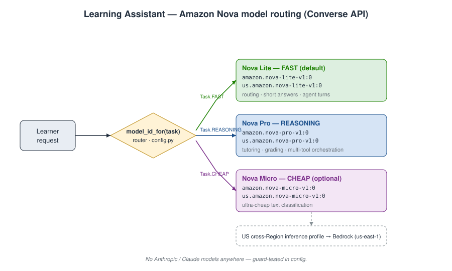
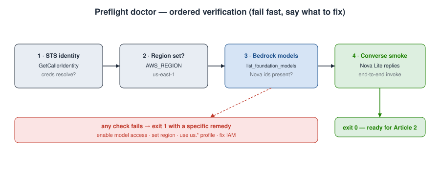

# Building a Learning Assistant on Amazon Bedrock — Part 1: The Architecture, and Why I Picked AgentCore + Amazon Nova

*Series: Build a Learning Assistant on Amazon Bedrock · Part 1 of 18*

Most "build an AI agent" tutorials stop at a single `converse()` call and a happy-path demo. The hard part — the part nobody shows you — is everything *after* that: grounding answers in real content, stopping the model from making things up, remembering a user across sessions, letting the agent call your APIs safely, and being able to prove any of it works in production.

This series builds exactly that, one piece at a time. We build **one** application — a learning assistant, an AI tutor for a course — and across 18 parts we grow it from a single model call into a governed, observable, production-grade agent on **Amazon Bedrock AgentCore**, using the **Amazon Nova** model family throughout.

This first part is the one with no glamour and all the leverage: the architecture decisions, the repo scaffold, and a preflight script that tells you — before you write a line of agent code — whether your AWS account can actually run any of it.

**Who this is for:** developers comfortable with Python and the AWS CLI who want to build real agents on Bedrock, not toy demos. You'll want an AWS account with Bedrock access and Python 3.12+.

---

## What we're building

The learning assistant answers a learner's questions about a course, grounded in the actual course material. By the end of the series it also:

- remembers the learner across sessions,
- grades submissions and fetches schedules by calling tools,
- refuses to answer off-topic questions and refuses to hallucinate,
- authenticates each learner and authorizes which tools the agent may use,
- and is measured and traced so you can see token cost, latency, and answer quality.

We build it the way you'd build real software: one capability per part, each shipping a working increment that plugs into the same app. You understand every layer because you added it yourself.

---

## The one decision that shapes everything: AgentCore, not legacy Agents

Amazon Bedrock gives you two different ways to build an agent, and conflating them is the most common early mistake.

| | **Agents for Amazon Bedrock** (legacy) | **Amazon Bedrock AgentCore** |
|---|---|---|
| Shape | Managed, **config-based** | **Unopinionated infrastructure** |
| The orchestration loop | **AWS runs it** | **You own it** (your framework + model) |
| You define | Action groups, knowledge bases, prompts | Your agent code; you wire in AgentCore services |
| Framework | Bedrock-coupled | Any: Strands, LangGraph, CrewAI, LlamaIndex |
| Model | Bedrock models | **Any** model, in or outside Bedrock |
| Best when | You want a quick, opinionated agent | You want a production agent you control end to end |

They are not competitors and one doesn't replace the other — they're different tools. Legacy Agents is the fast path when you're happy to let AWS run the loop. **AgentCore** is a set of modular services — Runtime, Memory, Gateway, Identity, Observability, plus Code Interpreter, Browser, Evaluations, and Policy — that you compose underneath *your own* orchestration code.

I chose AgentCore for this series for one reason: the whole point is to *see* each layer. A learning assistant genuinely needs per-learner auth, tool authorization, memory, evaluation, and observability — and I want those to be explicit boxes we add on purpose, not magic hidden inside a managed loop.

> A note on dates and status: AgentCore reached general availability on 2025-10-13 (nine AWS Regions at launch). Services I reference across this series — including Evaluations, Policy, and Payments — have since gone GA as well. Service status, Region coverage, and pricing all change over time, so check the [AgentCore documentation](https://docs.aws.amazon.com/bedrock-agentcore/latest/devguide/what-is-bedrock-agentcore.html) and the [pricing page](https://aws.amazon.com/bedrock/agentcore/pricing/) for the current picture before you build.

### The end state we're heading toward


Don't worry about every box yet — we add one per part. Today we only lay the foundation. (The editable source for every diagram in this series lives beside it as a `.drawio` file, so you can fork and adapt them.)

---

## Why Amazon Nova — and how we route between models

This series uses the **Amazon Nova** family exclusively. No Anthropic/Claude models anywhere — a deliberate constraint, both to keep costs predictable and to show that a serious agent can be built entirely on Amazon's own models.

Three Nova "understanding" models matter here, and the trick is not picking one — it's **routing between them by task**:

| Tier | Model | Converse `modelId` | Context | Why |
|------|-------|--------------------|---------|-----|
| **fast** (default) | Nova Lite | `us.amazon.nova-lite-v1:0` | 300K | Low latency and cost; great for routing, classification, short answers, and the many quick agent turns |
| **reasoning** | Nova Pro | `us.amazon.nova-pro-v1:0` | 300K | The heavy lifting: tutoring explanations, grading, multi-tool orchestration |
| **cheap** (optional) | Nova Micro | `us.amazon.nova-micro-v1:0` | 128K | Ultra-cheap text-only fallback for high-volume classification |

Nova Pro and Lite are multimodal (text, image, and video in → text out), which we'll lean on later when the assistant ingests PDFs and lesson videos. All three support the Converse API, streaming, tool use, and batch inference.

The design principle: **default to Nova Lite, escalate to Nova Pro only when a step actually needs the reasoning.** Most agent turns are routing and glue; paying Pro prices for those is wasteful. Here's the routing we're after:



Two things worth calling out in that diagram:

1. **We address models through inference profiles**, not raw model IDs. The `us.` prefix (`us.amazon.nova-pro-v1:0`) is a US cross-Region inference profile — it lets Bedrock serve the request from whichever Region in the profile has capacity, which smooths out throughput. You pass the profile ID to Converse's `modelId` field exactly where you'd pass a model ID.
2. **Routing lives in one place.** There's a single function, `model_id_for(task)`, that every part of the app calls. Change a tier's model once and the whole app follows.

---

## The scaffold

Everything above is just talk until there's code to hang it on. Part 1 ships a small Python package, `learning_assistant`, that later parts import and extend. It lives once at the repo root and **grows one module per part** — this series builds a single evolving app, not 18 disconnected snippets:

```
AWS_Bedrock_series/                   # repo root — clone + install once
├── README.md                         # series roadmap (start here)
├── RESEARCH.md                       # feature reference
├── LICENSE
├── pyproject.toml                    # ONE package for the whole series
├── src/learning_assistant/
│   ├── __init__.py                   # public config surface
│   ├── config.py                     # region + Nova routing  ← the heart of it
│   └── doctor.py                     # verifies creds, region, model access
│                                     #   (converse.py arrives in Part 2, retrieval.py in Part 5 …)
├── tests/
│   └── test_config.py                # offline routing tests (no AWS needed)
├── docs/adr/0001-platform-and-stack.md
└── articles/
    └── 01-intro-and-architecture/
        ├── blog.md                   # this article
        └── diagrams/                 # .drawio sources + rendered .svg
```

The article prose points at `src/learning_assistant/config.py`; you clone once, `pip install -e .` once, and watch the package grow as the series progresses.

### `config.py` — one source of truth for region and models

The whole model-routing policy is a dataclass catalog plus a `Task → model` map. This is the part you'll touch most as the series grows, so it's deliberately boring and explicit:

```python
from dataclasses import dataclass
from enum import Enum
import os

AWS_REGION = os.getenv("AWS_REGION", "us-east-1")

class Task(str, Enum):
    FAST = "fast"        # routing, classification, short answers, latency-sensitive turns
    REASONING = "reason" # tutoring, grading, multi-tool agent orchestration
    CHEAP = "cheap"      # ultra-cheap text-only classification fallback

@dataclass(frozen=True)
class NovaModel:
    name: str
    model_id: str            # base on-demand model id
    inference_profile: str   # US cross-Region inference profile (preferred for Converse)
    context_window: int

NOVA_PRO  = NovaModel("Amazon Nova Pro",  "amazon.nova-pro-v1:0",  "us.amazon.nova-pro-v1:0",  300_000)
NOVA_LITE = NovaModel("Amazon Nova Lite", "amazon.nova-lite-v1:0", "us.amazon.nova-lite-v1:0", 300_000)
NOVA_MICRO = NovaModel("Amazon Nova Micro", "amazon.nova-micro-v1:0", "us.amazon.nova-micro-v1:0", 128_000)

_ROUTING = {Task.FAST: NOVA_LITE, Task.REASONING: NOVA_PRO, Task.CHEAP: NOVA_MICRO}
```

And the function every caller uses — prefer the inference profile, let an environment variable override it when you need to pin an exact ID for a reproducible sample:

```python
def model_id_for(task: Task = Task.FAST, *, use_inference_profile: bool = True) -> str:
    override = {Task.REASONING: os.getenv("NOVA_REASONING_MODEL_ID"),
                Task.FAST: os.getenv("NOVA_FAST_MODEL_ID")}.get(task)
    if override:
        return override
    model = _ROUTING[task]
    return model.inference_profile if use_inference_profile else model.model_id
```

Calling it reads the way you'd hope:

```python
model_id_for(Task.FAST)       # 'us.amazon.nova-lite-v1:0'   — the default
model_id_for(Task.REASONING)  # 'us.amazon.nova-pro-v1:0'    — when it matters
```

### Pinning the decisions as an ADR

Design decisions rot when they live only in your head. I committed the six foundational ones — AgentCore over legacy Agents, Strands as the framework, the Nova family, `us-east-1`, Python 3.12+, and starting on S3 Vectors — as an **Architecture Decision Record** at `docs/adr/0001-platform-and-stack.md`. Every later part reads from it, and changing any decision requires a superseding ADR. It's a cheap habit that keeps a long series internally consistent.

---

## The preflight doctor

Here's the thing that saves you an afternoon: before building anything, run a script that checks your account can actually do the work. "Model access not enabled in this Region" is the single most common Bedrock wall, and it produces an error message several layers removed from the real cause. So the scaffold ships a `doctor` that checks the four things that go wrong, in order, and fails fast with a specific remedy.



The two checks that matter most are the model-access check and the live smoke test. The smoke test is the honest one — it actually invokes Nova Lite through Converse and reads the reply, so a green result means end-to-end invocation genuinely works, not just that the model is *listed*:

```python
def _check_converse_smoke() -> bool:
    model_id = model_id_for(Task.FAST)  # Nova Lite inference profile
    rt = boto3.client("bedrock-runtime", region_name=AWS_REGION)
    resp = rt.converse(
        modelId=model_id,
        messages=[{"role": "user", "content": [{"text": "Reply with the single word: ready"}]}],
        inferenceConfig={"maxTokens": 16, "temperature": 0.0},
    )
    text = "".join(b.get("text", "") for b in resp["output"]["message"]["content"]).strip()
    print(f"[ OK ] Converse smoke test — Nova Lite replied: {text!r}")
    return True
```

That snippet, by the way, is also your first taste of the Converse API — the `messages` → `content` → `text` shape and the `inferenceConfig` block are exactly what Part 2 builds on.

---

## Try it yourself

```bash
# 1. Clone the repo and enter it
git clone <your-repo-url> AWS_Bedrock_series
cd AWS_Bedrock_series

# 2. Create a virtualenv and install (Python 3.12+)
python -m venv .venv
# macOS/Linux:
source .venv/bin/activate
# Windows PowerShell:
# .venv\Scripts\Activate.ps1
pip install -e ".[dev]"

# 3. Configure AWS credentials in your terminal (the doctor uses standard boto3 resolution)
aws configure            # or: aws sso login --profile <name>
export AWS_PROFILE=<name>
export AWS_REGION=us-east-1
```

Make sure the three Nova models are enabled for your account in **Bedrock console → Model access**, in `us-east-1`. Then run the doctor:

```bash
python -m learning_assistant.doctor
```

A healthy run looks like this:

```
Learning Assistant — preflight doctor
--------------------------------------
[ OK ] AWS credentials — account 123456789012, arn arn:aws:iam::123456789012:user/you
[ OK ] Region — us-east-1
[ OK ] Model listed — amazon.nova-pro-v1:0
[ OK ] Model listed — amazon.nova-lite-v1:0
[ OK ] Model listed — amazon.nova-micro-v1:0
[ OK ] Converse smoke test — Nova Lite replied: 'ready'
--------------------------------------
All checks passed. You're ready for Article 2.
```

If a model shows `[WARN] Model NOT listed`, that's your model-access gap — enable it in the console and re-run. The offline routing tests need no AWS at all and are the fastest sanity check that the package imports and routes correctly:

```bash
pytest        # 4 passed — includes a guard asserting no 'claude'/'anthropic' id can appear
```

That last test is a small insurance policy: it fails the build if a Claude model ID ever sneaks into the catalog, which keeps the "Nova only" promise honest as the code grows.

---

## How to think about the bill

Bedrock and AgentCore are consumption-based — each service is metered independently, and the AgentCore harness itself is free; you pay for the underlying resources. The levers, roughly in the order they'll bite:

- **Model inference** — per input/output token on Converse. This is your biggest early lever, and it's exactly why the Nova Lite-by-default routing matters. Part 4 adds **prompt caching**, which cuts the cost of repeated prompt prefixes dramatically.
- **Runtime / Browser / Code Interpreter** — billed on active consumption (CPU-hour + GB-hour, per second).
- **Memory / Gateway / Identity / Policy** — each metered separately as you add them.
- **Knowledge Bases** — embedding generation + vector-store cost + retrieval calls.

Every part in this series ends with a short cost note, so the running total is never a surprise. (Pricing figures move — I'm deliberately not quoting per-unit numbers here; check the current [AgentCore pricing page](https://aws.amazon.com/bedrock/agentcore/pricing/).)

---

## What's next

**Part 2 — Your first real call.** We take the Converse snippet from the doctor and turn it into a small CLI that answers a single learner question: streaming responses, choosing between Nova Lite and Pro at runtime, and handling the inference-profile plumbing properly. That CLI is the seed the entire assistant grows from.

If you build along, drop a comment with your `doctor` output — I'm curious which Region/model-access combination trips people up most.

---

### Sources

- [Amazon Nova models — IDs, context windows, modalities](https://docs.aws.amazon.com/nova/latest/userguide/what-is-nova.html)
- [Amazon Bedrock AgentCore overview](https://docs.aws.amazon.com/bedrock-agentcore/latest/devguide/what-is-bedrock-agentcore.html)
- [AgentCore pricing](https://aws.amazon.com/bedrock/agentcore/pricing/)
- [Converse API reference](https://docs.aws.amazon.com/bedrock/latest/userguide/conversation-inference.html)
- [Cross-Region inference profiles](https://docs.aws.amazon.com/bedrock/latest/userguide/inference-profiles-use.html)
